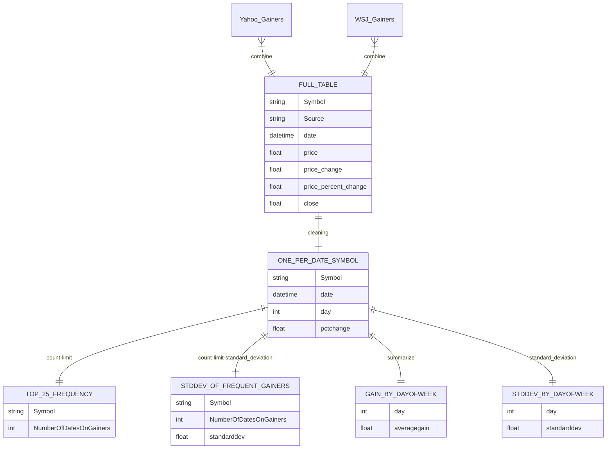

**REPORT**

*Analyzing Daily Gainers Data for Company X*

The goal of this analysis and framework is to allow us to communicate results and meaning to colleagues who may not be financial-data literate. We should also be able to communicate how this data is created and what other information we can glean along the way.

Use Cases:
  * Volatility: This measure would allow us to identify stocks that have a more stable trend. We likely do not want to overexpose our investment portfolio to stocks that are highly volatile.
  * Daily Measures: Measures containing the days of the week, and other non-traditional factors, may help us highlight implicit human biases that we can take advantage of, such as if markets are more likely to improve on a Friday when people are in a better mood.

We begin by scraping gainers data from various sources (most notably Yahoo and the Wall Street Journal). 
From here the data is processed and normalized to create identical structures for data gathered at different times, timestamped for future use. 
We then follow the procedure seen in the Diagram above to create Intermediate and Final tables for futhur use and analysis.

In Summary, our current format brings forward interesting new lenses through which to view and understand this data. 
Of course, there is always more work in this regard that can be done. For instance, grouping these tickers into Sectors may let us identify more trends or give us greater confidence (with a de facto bigger sample size). 
In any event, the data we have generated thus far absolutely moves us closer to our goals of understanding and using patterns in financial markets to our advantage.
